 # CHARMM-GUI Bilayer Builder (Membrane Embedding)

This section explains how to embed the cleaned protein-only PDB into a lipid bilayer using CHARMM-GUI Bilayer Builder. We start from the protein-only structure created earlier, with all waters, ions, and ligands removed.

## 2A. Upload the Protein
We go to https://www.charmm-gui.org/ but first we have to register.
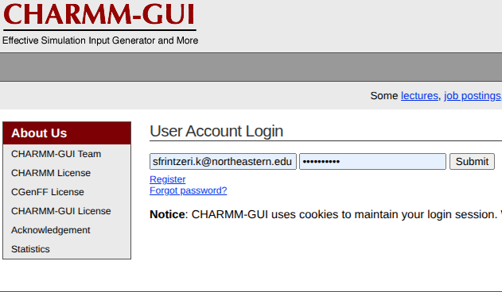

Go to CHARMM-GUI → Membrane Builder → Bilayer Builder.

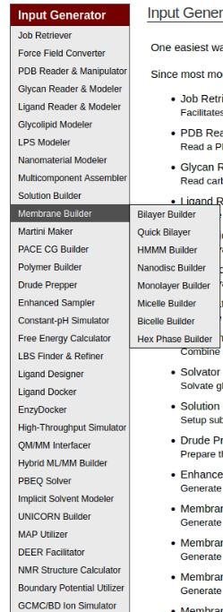

Upload the protein-only PDB file *pdb4amber_G2_S181P_proteinonly.pdb*. CHARMM-GUI will automatically recognize the chains, detect engineered residues, and assign chain labels such as PROA, PROB, PROC, and PROD.

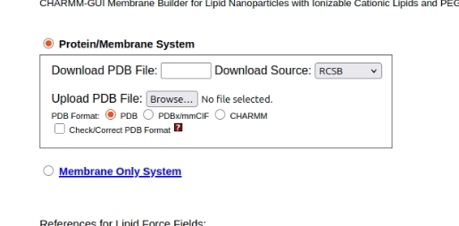

## 2B. Step 1 — PDB Reader

CHARMM-GUI standardizes the uploaded PDB by converting it into CHARMM-compatible atom names and formats. It also splits the structure internally into separate chains and creates CHARMM PDB, PSF, and CRD files.

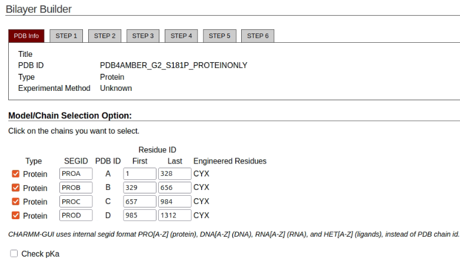

No changes are required here because protonation, disulfide bonds, and ligand parameters will be set later in H++ and tleap.

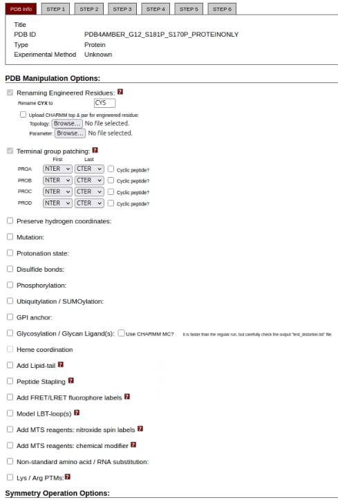

## 2C. Step 1 — Protein Orientation Using PPM

CHARMM-GUI provides several options to orient the protein relative to the membrane. For membrane proteins, the recommended method is *Run PPM 2.0* so we check this box

PPM (Positioning of Proteins in Membranes) analyzes the hydrophobic thickness and orients the transmembrane region along the Z-axis.

We also ckechthe box *Generate Pore Water and Measure Pore Size*.


## 2D. Step 2 — Verify Orientation and Set System Size

CHARMM-GUI now displays the PPM-oriented structure. Ensure that the transmembrane helices are centered correctly along the membrane normal.

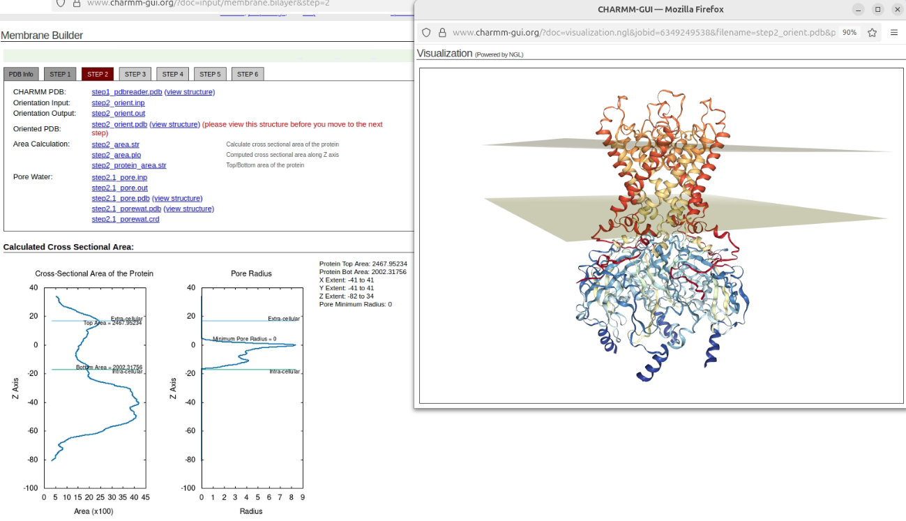

Next, set the X and Y dimensions of the system box. We set *Length of X and Y:* to 100Å

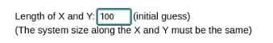

## 2E. Step 2 — Define Lipid Composition

Scroll down to the lipid lists and choose the lipid ratios for the upper and lower leaflets. A typical composition for GIRK channels includes:

+ POPC
+ POPE
+ POPS
+ Cholesterol

**We set the ratios as following:**

| Lipid | Upper Leaflet | Lower Leaflet |
|-------|---------------|---------------|
| Cholesterol | 1 | 1 |
| POPC | 25 | 25 |
| POPE | 5 | 5 |
| POPS | 5 | 5 |

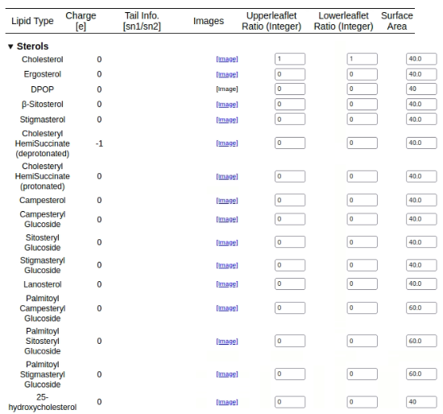
*In Sterols we set Cholesterol to 1 and 1*

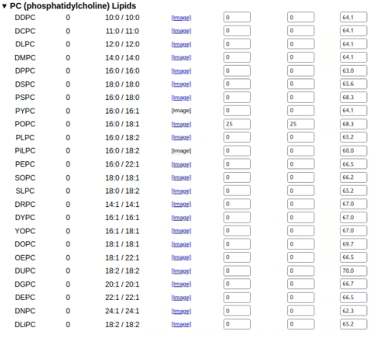
*In PC Lipids we set POPC to 25 and 25*

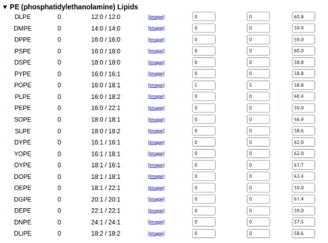
*In PE Lipids we set POPE to 5 and 5*

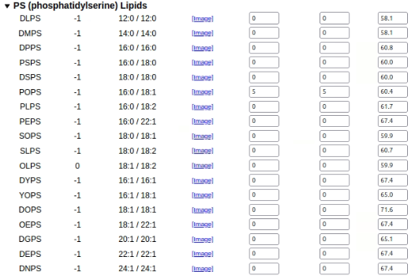
*In PS Lipids we set POPS to 5 and 5*

When finished, click "Show the system info" to check the calculated number of lipids and the membrane surface area. 

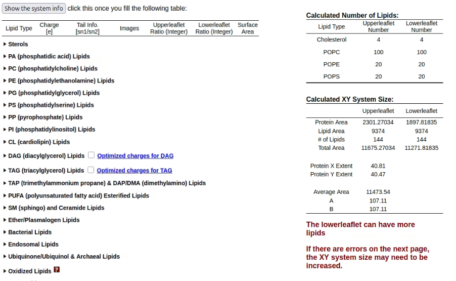

If CHARMM-GUI shows a warning about area mismatch, click "OK" to continue.

## 2F. Step 3 — Add Ions and Solvent

In the ion placement step, we use the Distance method for ion placement because it is faster than Monte Carlo.

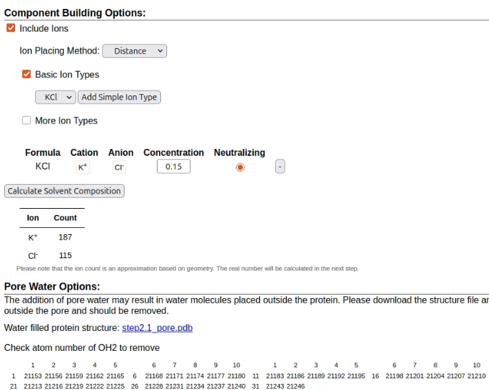

Click "Calculate Solvent Composition" to let CHARMM-GUI determine how many K⁺ and Cl⁻ ions are required, if this information is not already shown.

## 2G. Step 4 — Build System Components

CHARMM-GUI now generates the following components:

+ Lipid bilayer
+ Ion box
+ Water box
+ Pore water

It automatically checks for lipid penetration into the protein, which typically does not occur for GIRK channels. We can click the view structure button to see the bilayer.

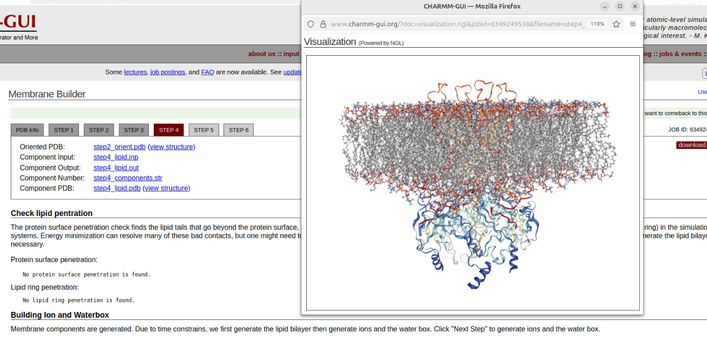

Continue to the assembly step.

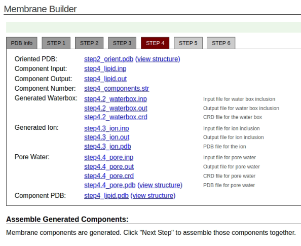

## 2H. Step 5 — Assemble the Full System and Choose Force Fields

CHARMM-GUI assembles the protein, lipids, water, and ions into a single system. The output includes a fully combined PDB file and CHARMM coordinate files.

We set *AMBER force field options:* to AMBER and we check the AMBER box to *Input Generation Options*.

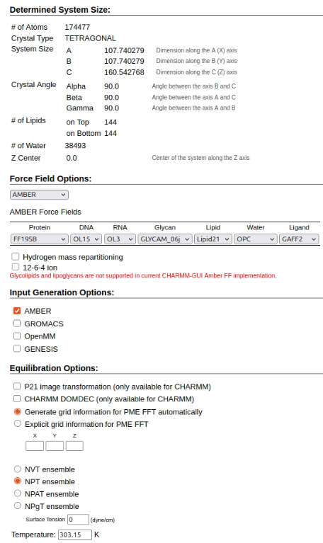

We will manually set the force field again in tleap, but the PDB generated by CHARMM-GUI can also be used directly for the MD simulations. CHARMM-GUI also provides the full AMBER equilibration protocol, including six equilibration steps with decreasing restraints.

## 2I. Step 6 — Download the Output Files

The final page contains download links for:

+ The assembled PDB
+ AMBER minimization input
+ AMBER equilibration inputs (steps 1–6)
+ AMBER production input
+ Restraint files
+ Crystal box information

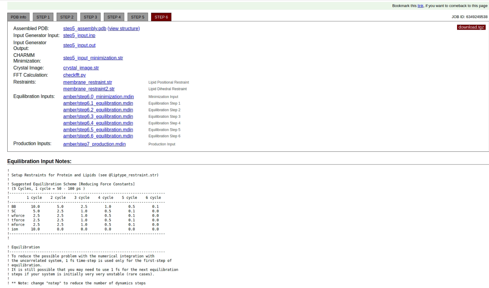

Download the entire `charmm-gui.tgz` archive for later use.

## 2J. Convert CHARMM Lipids to AMBER Format

Use the script `charmmlipid2amber.py` to convert CHARMM-style lipid residues into AMBER-compatible ones. The input in this command is step5_assembly.pdb, which you will find in the charmm-gui.tgz after you extract it.

**Example:**

```bash
charmmlipid2amber.py -i step5_assembly.pdb -c charmmlipid2amber.csv -o converted_system.pdb
```

This produces a PDB containing AMBER lipid names.

To use this command we first need to locate where the charmmlipid2amber.csv is in our cimputer by using the following command:

```bash
locate charmmlipid2amber.csv
```

The we should use the charmmlipid2amber command as following:
```bash
charmmlipid2amber.py -i step5_assembly.pdb -c /home/ziyue/miniforge3/envs/Amber/dat/charmmlipid2amber/charmmlipid2amber.csv -o DOPC_128.pdb 
```

## 2K. Split Protein and Membrane 

Next we need to extract the protein and membrane into separate PDB files. We need this step because we didn't use the final protein for the membrane construction so later we will need to concatenate the correct combination of memebrane and protein.
We open the DOPC_128.pdb file and we search for CHL. We store the last numbers of the PIP and the forst number of the lipid bilayer as we will use them in the following commands. In out case these numbers are 21152 and 21153.


**To extract the protein:**

```bash
head -n 21152 DOPC_128.pdb > proteinonly.pdb 
```

**To extract the membrane:**

```bash
tail -n +21153 DOPC_128.pdb > membrane.pdb 
```

## Summary

At the end of the CHARMM-GUI Bilayer Builder step, you should have:

+ A correctly oriented membrane protein
+ A defined XY box size appropriate for the lipid bilayer
+ A complete POPC/POPE/POPS/Cholesterol membrane
+ Water and ions added at the desired concentration
+ A fully assembled AMBER-ready system
+ A combined system PDB suitable for further processing
+ Separate protein and membrane PDB files

**Next step:** Protonation and pKa Assignment (H++ Server).
