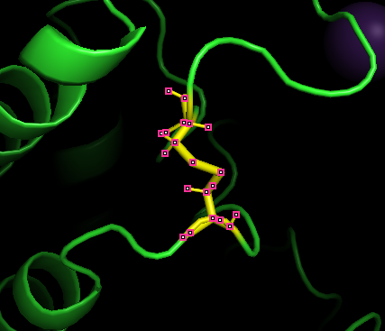

## 🧪 My Example: Preparing the GIRK2 Channel (3SYC)

To test this workflow, I used the structure [**3SYC**](https://www.rcsb.org/structure/3SYC), which is the **crystal structure of the G protein-gated inward rectifier K⁺ channel GIRK2 (Kir3.2), D228N mutant**. The structure contains **only the protein** (no ligands), and I wanted to simulate it using AMBER.

At first, I thought I could follow the one-file `tleap.in` approach shown above, but I quickly discovered that it wouldn’t work for this system. Here's why:

---

## ❌ Why a Single `tleap.in` File Wasn't Enough

### 1. 🔍 The PDB Includes a Disulfide Bond That TLeap Won’t Handle Automatically

In the original PDB file, there is a clear disulfide bond listed:

```
SSBOND   1 CYS A  134    CYS A  166                          1555   1555  2.04
```

You might think that this means you can write in `tleap.in`:

```bash
bond mol.134.SG mol.166.SG
```

But **this won’t work** — and here’s why:

---

### 2. 🧬 The Atom Indexing Changes After Adding Hydrogens

In the original PDB, the residue numbering begins at residue **55**:

```
ATOM      1  N   ILE A  55      ...
```

But when you load this into TLeap and save a new PDB (e.g., `first_with_hydrogens.pdb`), the residues get **renumbered starting at 1**. So:

- Original residue **CYS 134** might become **residue 80**
- Original **CYS 166** might become **residue 112**, for example

This means the line `bond mol.134.SG mol.166.SG` will fail, because those residue numbers **no longer exist** in the modified file.

---

### 3. 🧪 The CYS Residues Must Be Renamed to CYX

Even if you get the new residue numbers right, you’ll hit another problem:

- **TLeap expects disulfide-forming cysteines to be named `CYX`**, not `CYS`
- If you leave them as `CYS`, the bond may not be recognized and will generate errors during parameter assignment

---

### 4. 🧼 The HG Hydrogen Must Be Deleted

One last critical detail:  
Each cysteine residue normally contains a **hydrogen atom named HG** attached to the sulfur (SG). But when forming a disulfide bond:

- **That hydrogen must be removed manually**, or TLeap will complain about missing torsion parameters involving HG
- You’ll get an error like `no torsion terms for atom types HS-SH-SH-HS`

---

## ✅ My Solution: Modular Automation

To fix all of this, I created a modular, automated workflow that:

1. Uses a first `tleap` script to **add missing hydrogens**
2. Uses a Python script to:
   - Parse the original residue numbers
   - Create a `tleap.in` file with the **correct mapped numbers**
   - Generate a `rename_cys_to_cyx.sh` script to:
     - Rename `CYS → CYX`
     - Delete the HG hydrogen from each CYX
3. Runs everything step-by-step inside a clean output folder

---

## 📥  Reproduce This Example

If you want to reproduce this with 3SYC:

### 🔧 Step 1: Download the PDB file (optional)
Go to [3SYC](https://www.rcsb.org/structure/3SYC), download it, and save it as:

```
3syc.pdb
```
Or download the girk2_3syc_example folder, the 3syc.pdb file is already included.

### 🧪 Step 2: Run the Full Preparation Script

Go to `girk2_3syc_example/` folder where the `run_all.sh` script and 3syc.pdb are located.  
Open your terminal and run:

```bash
cd girk2_3syc_example/
bash run_all.sh 3syc.pdb
```

---

### 🚀 What This Script Will Do

This command automatically performs all the setup steps for running AMBER simulations:

- ✅ **Creates a folder** named `3syc/` to keep everything organized.
- ✅ **Adds missing hydrogens** to the protein structure using TLeap.
- ✅ **Handles disulfide bonds** by:
  - Renaming `CYS` residues involved in `SSBOND` links to `CYX`
  - Deleting the `HG` atom from each `CYX` (required for disulfide bonding)
  - Automatically creating the disulfide bonds in TLeap
- ✅ **Adds ions** (`K⁺`, `Cl⁻`) to neutralize the system
- ✅ **Solvates** the system in a **TIP3P water box** (10 Å buffer)
- ✅ **Generates AMBER input files**, saved in:

```
3syc/amber_input/
├── com.prmtop       # Topology file for AMBER
├── com.inpcrd       # Coordinates file for AMBER
└── with_water.pdb   # Solvated, neutralized structure (for visualization)
```

Once completed, you’ll be ready to start **energy minimization** using these AMBER-ready files.

### 📸 Visualizing the Disulfide Bond

Below is a snapshot of the disulfide bridge formed between two `CYX` residues in the GIRK2 channel, as rendered in PyMOL using the final solvated structure (`with_water.pdb`) produced by the preparation script:

<p align="center">
  
</p>

This covalent bond (colored red in this representation) connects the sulfur atoms (`SG`) of the two CYX residues that originally were annotated as `CYS` in the PDB file.

This ensures that the structural integrity of the protein is preserved during simulation.

---

⬅️ [Back to Homepage](./README.md)

⬅️ [Back to TLeap Input Script](./tleap.md)
