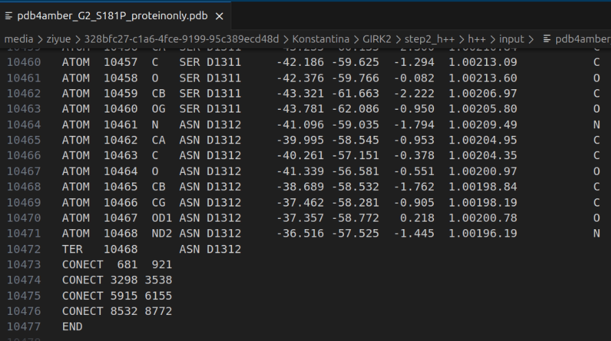
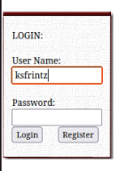
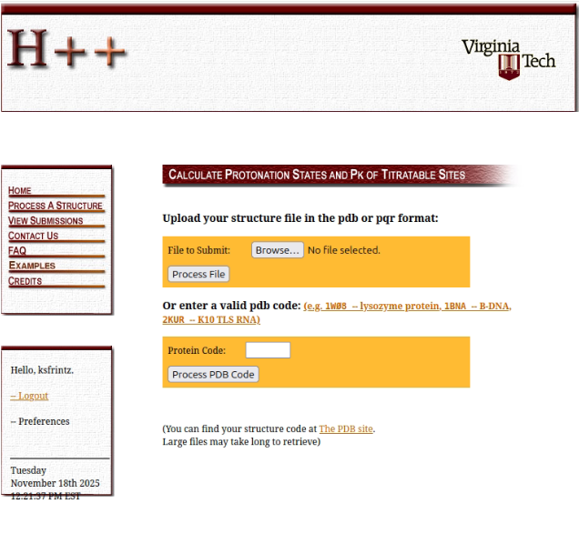
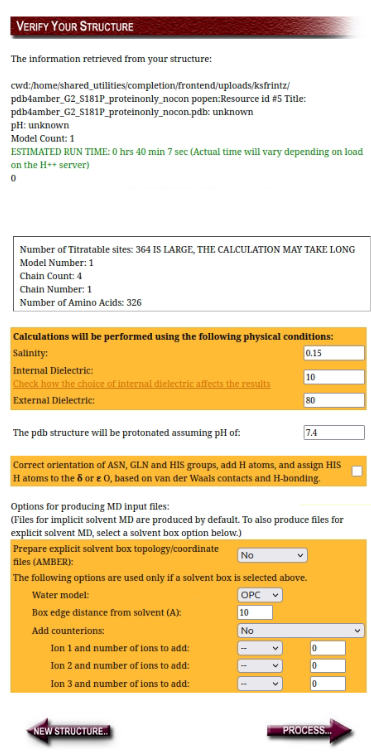
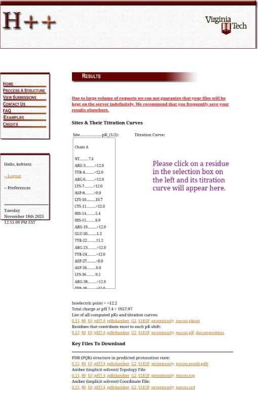
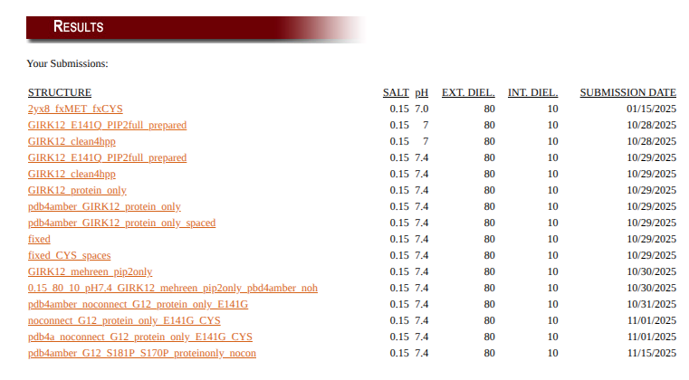
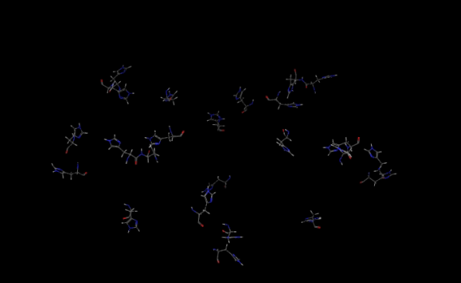

# Protonation and pKa Assignment (H++ Server)

H++ is used to add hydrogens, determine protonation states, flip Asn/Gln/His residues when necessary, and prepare a structure with correct ionization states at the desired pH. The H++ output will later be merged back with the protein–PIP₂–ion system.

---
## 1. Prepare PDB Using pdb4amber

Use `pdb4amber` to sanitize atom names, remove hydrogens, and ensure compatibility:

```
pdb4amber -i ./input/G2_S181P_proteinonly.pdb -o ./output/pdb4amber_G2_S181P_proteinonly.pdb --nohyd
```

## 2. Clean the Structure Before Submitting to H++

H++ requires:
- protein only  
- no ligands  
- no PIP₂  
- no ions  
- no CONECT records at the end of the PDB

We have already deleted ligands, PIP₂ and ions in teh previous step.

### **2A. Remove CONECT Records**

We open *pdb4amber_G2_S181P_proteinonly.pdb*. 
At the end of the PDB, delete all lines beginning with CONNECT

 <br>
*End of pdb4amber_G2_S181P_proteinonly.pdb*

We rename the file to *pdb4amber_G2_S181P_proteinonly_nocon.pdb* to remember we deleted them

---
## 3. Register to H++ server
To submit a job in H++ server we first need register and then sign in.

 <br>


## 4. Submit the File to H++

Upload `GIRK12_clean4hpp.pdb` to the H++ server at: http://newbiophysics.cs.vt.edu/H++/

 <br>

We set:
- **pH = 7.4**  
- Disable: *Correct orientation of ASN, GLN, and HIS groups, add H atoms, and assign HIS H atoms to δ or ε based on contacts*

H++ will read:

- Number of titratable sites  
- Number of chains  
- Estimated run time  
- Structural warnings  
- Protonation summary  

 <br>

---

## 4. Download the Key Output Files

Download:

- **PDB (PQR) structure in predicted protonation state**  
- **AMBER topology file (.top)**  
- **AMBER coordinate file (.crd)**  

 <br>

```
0.15_80_10_pH7.4_pdb4amber_G2_S181P_proteinonly_nocon.result.pdb
0.15_80_10_pH7.4_pdb4amber_G2_S181P_proteinonly_nocon.crd.top
0.15_80_10_pH7.4_pdb4amber_G2_S181P_proteinonly_nocon.crd.crd
```
Sometime the H++ server seems like it is frozen while processing the pdb. If this is happening, you can see the progress of your submission by selecting the 
*view submissions* on side bar and selecting the last submission. Be patient, it may take 10 minutes to run, if it is taking longer than that there may be an error, so check the produced error files.

 <br>

---

## 5. Convert Topology + Coordinates Back to a PDB

We will not use the 0.15_80_10_pH7.4_pdb4amber_G2_S181P_proteinonly_nocon.result.pdb. Use `ambpdb` to generate a PDB with all hydrogens added by H++:

```
ambpdb -c 0.15_80_10_pH7.4_pdb4amber_G2_S181P_proteinonly_nocon.crd -p 0.15_80_10_pH7.4_pdb4amber_G2_S181P_proteinonly_nocon.top >0.15_80_10_pH7.4_pdb4amber_G2_S181P_proteinonly_nocon.pdb
```

This is the protonated protein structure.

---

## 6. Inspect Protonation States in VMD

Open the new PDB in VMD:
```
vmd 0.15_80_10_pH7.4_pdb4amber_G2_S181P_proteinonly_nocon.pdb
```

Check:
- Whether protonation is consistent across **all four subunits**  
- Histidine types: **HIE**, **HID**, **HIP**  
- Any suspiciously protonated residues  
- Any missing heavy atoms (should not occur if pdb4amber was used)  

Example selection to highlight HIE:
```
resname HIE
```

 <br>

Visual inspection is critical, especially around functional regions.

---

# Summary

After completing H++:

- You have a protonated protein at pH 7.4  
- Missing hydrogens added  
- Structure converted to PDB via `ambpdb`  

You are now ready for:

**Step 3 — Membrane System Construction (CHARMM-GUI)**


