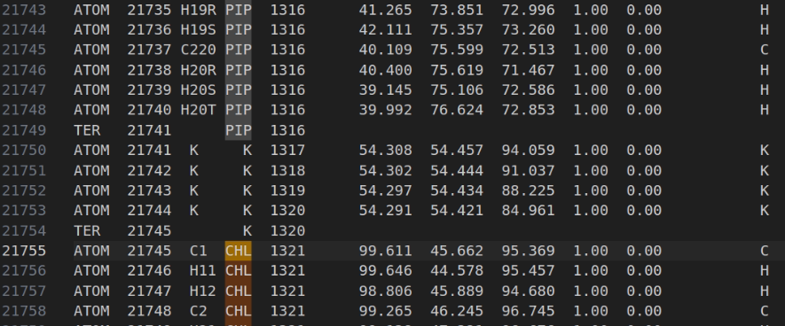
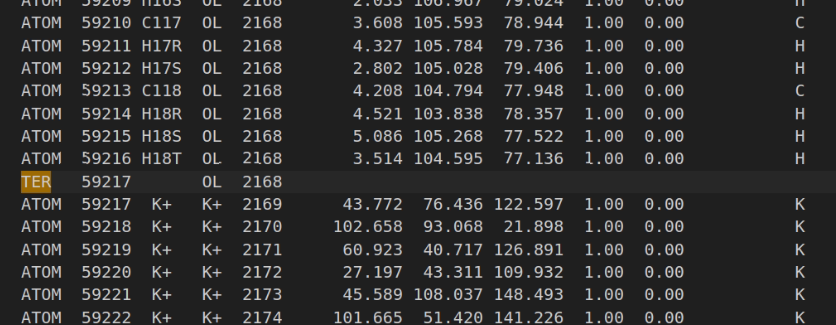

# 6. Energy Minimization, Heating, Equilibration, and Production MD

Once the AMBER topology (`com.prmtop`) and coordinates (`com.inpcrd`) are prepared, we proceed with the standard MD workflow:

1. Minimization
2. Heating
3. Equilibration (Hold)
4. Production MD

We run minimization and heating on CPU, and equilibration/production on GPU.

## 6A. Minimization

We begin with a short minimization to relax bad contacts while keeping the protein and PIPs restrained.

### Minimization Input File (Min.in)

```
Minimization with Cartesian restraints for the solute
&cntrl
 imin=1,
 maxcyc=100,
 ntpr=5,
 ntmin=2,
 ntr=1,
&end
/
500.0
RES 1 1316
END
END
```

### Explanation

- `RES 1 1316` corresponds to protein + PIPs.
- In this system, the PIPs end at residue 1316, so we restrain residues 1–1316 with 500 kcal/mol·Å².

### Running Minimization

Use cpptraj to extract the minimized structure:

```bash
cpptraj ./input/com.prmtop <<EOF
trajin ./output/min/rst/min2.rst
trajout min2_minimized.pdb pdb
run
quit
EOF
```

## 6B. Heating

We use three heating steps.

Before running them, the restraint lines must be adapted for your residue numbering.

### Example restraint blocks used in `02_Heat.in` and `03_Heat2.in`:

```
500.0
RES 1 1316
END

10.0
RES 1321 2168
END
```

- **Protein + PIPs:** residues 1–1316
- **Lipids:** residues 1321–2168

Lipids receive only weak restraints so they can adapt to the protein surface.

 <br>
*End of protein and PIPs, start of bilayer*

 <br>
*End of lipid bilayer*

## 6C. Running Minimization and Heating

We use the script:

```bash
./submit_min_heat.sh RUN1
```

Where:

- `RUN1` is the name of the new folder created for this run
- You can run additional simulations by using different names (`RUN2`, `RUN3`, etc.)

The script performs:

- 2 minimizations
- 3 heating steps (gradual temperature increase)

The first steps are very fast; the later heating steps may take 1–2 hours.

The `info` files inside `output/info` show the estimated time.

We run these steps on CPU using MPI:

```bash
mpirun -n 32 pmemd.MPI ...
```

You can adjust the number of CPUs depending on your machine.

## 6D. Inspecting the System After Heating

After heating, generate a PDB from the last restart file:

```bash
cpptraj ./input/com.prmtop <<EOF
trajin ./output/RUN1/rst/03_Heat3.rst
trajout heat3.pdb pdb
run
quit
EOF
```

Open `heat3.pdb` in VMD.

### Check for Atom Clashes in VMD

1. Open VMD
2. Go to **Extensions → Tk Console**
3. Load the setup script:

```tcl
source vmd_setup.tcl
```

This places a reference residue at the center of the pore.

4. Go to **Graphics → Representations**, click **Create Rep**, and use the following selections:

**Check if PIP overlaps with protein:**

```
resname PIP and within 1.5 of protein
```

**Check if membrane overlaps with PIP:**

```
not water and not protein and not resname PIP and within 1.5 of resname PIP
```

**Check if membrane overlaps with protein:**

```
not water and not protein and not resname PIP and within 1.5 of protein
```

If no clashes are visible, your heated structure is ready for equilibration.

## 6E. Equilibration (Hold)

We run 10 hold steps, each gradually releasing restraints.

This stabilizes:

- lipid packing
- protein–membrane contacts
- PIP interactions
- internal protein flexibility

Each hold step usually takes ~5 minutes on GPU.

We run them using:

```bash
pmemd.cuda -O -i 04_HoldX.in ...
```

To run all the steps we run the *submit_hold.sh* script the following way:

```bash
./submit_hold RUN1
```


This section uses GPU acceleration because equilibration requires more timesteps.

> **Important:** 
> - Run these steps on the lab computer at `ziyue@10.75.11.111`
> - Run the following production steps on computer `yongcheng@10.75.9.85`
> - Alternatively, you can run all steps on the Explorer cluster: https://rc-docs.northeastern.edu/en/explorer-main/connectingtocluster/index.htm. You can find the commands to run everything in explorer here" [**Explorer commands**](./explorer.md)


## 6F. Production MD

Production MD is the main simulation stage where we generate the long trajectories used for all downstream analyses. These simulations are executed using `pmemd.cuda`, which provides maximum performance on NVIDIA GPUs.

### Simulation Length

For this project, production is divided into five segments, and each segment is defined in the input file using:

- `nstlim = 34000000` → 34 million MD steps
- `dt = 0.003` ps → 3 fs timestep (HMR enabled)

This results in:

```
34,000,000 steps × 0.003 ps = 102,000 ps ≈ 102 ns per segment
```

So every block is approximately **100 ns** of simulation time. Running 5 blocks gives a total of **~500 ns**.

Splitting production into five ~100 ns chunks makes the workflow:

- easier to restart if a job crashes
- compatible with HPC queue limits
- safer (you never lose the whole run)
- simpler to continue (each block starts from the previous `.rst`)
- easier to merge into a single continuous trajectory

### Launching Production MD

We submit the full 5-segment production using:

```bash
./submit_prod.sh RUN1
```

This command:

- creates a folder named `RUN1/`
- automatically starts all 5 production blocks
- uses the correct restart file for each step
- writes all `.rst`, `.out`, `.info`, and trajectory files inside `RUN1/`

Each block internally uses a command of the form:

```bash
pmemd.cuda -O \
  -i 05_Prod.in \
  -o 05_Prod1.out \
  -p com.prmtop \
  -c 04_Hold10.rst \
  -r 05_Prod1.rst \
  -x 05_Prod1.mdcrd
```

For block 2, tleap uses:

```bash
-c 05_Prod1.rst
```

For block 3:

```bash
-c 05_Prod2.rst
```

And so on until all five segments are complete.

### Combining the Segments into One Continuous Trajectory

After all 5 blocks finish, we create the final NetCDF trajectory using:

```bash
./create_nc.sh RUN1
```

This script:

- reads all five `05_ProdX.mdcrd` or `.nc` files
- orders them correctly
- stitches them together
- outputs a single continuous trajectory in outpur folder named `protein.nc`

This is the file used for all long-timescale analyses.

---
 usually named `RUN1_production.nc`
# Summary

At the end of this stage, you will have:

- Minimized structure (relaxed contacts)
- Heated system (at target temperature)
- Equilibrated membrane–protein–PIP arrangement
- Production MD trajectory, ready for analysis

You can now proceed with:

- RMSD, RMSF
- hydrogen bonds
- ion permeation tracking
- and any custom analysis scripts
