# 4. System Assembly in Maestro

In this step, we assemble the full protein–PIP–ion structure inside Maestro. This is necessary because:

- H++ gives correct protonation,
- the preprocessed PDB has correct headgroup positions,
- the CHARMM-GUI PDB has correct membrane coordinates,
- and the full PIP molecule comes from `PIP.pdb`.

We must bring all these pieces together into one pdb before sending the structure to tleap.

## 4A. Import All Required Structures

Create a new Maestro project and import the following four files:

- `0.15_80_10_pH7.4_pdb4amber_G2_S181P_proteinonly_nocon.pdb` — This is the fully protonated protein from H++.
- `G2_S181P.pdb` — This contains the truncated PIP headgroups and the ions in the right biological positions.
- `PIP.pdb` — This contains the full PIP2 molecule we want to place in the lipid bilayer.
- `proteinonly.pdb` — This comes from CHARMM-GUI and contains the protein in the correct membrane orientation.

After importing, confirm that all files appear in the Entries Panel.

This ensures that each component (protein, PIPs, ions) is available to be aligned and merged.

## 4B. Align the H++ Output to the Preprocessed Structure

We first align:

**H++ protonated structure → G2_S181P.pdb**

because:

- the protonation from H++ is correct,
- but the headgroups and ions in `G2_S181P.pdb` are in the correct membrane-relative positions.

Open:

**Tools → Protein Structure Alignment**

**Important:** Make sure the reference structure (`G2_S181P.pdb`) is placed above the H++ structure in the Entries table.

Use:

- Residue-based alignment
- All chains included

This places the H++-protonated protein exactly where the preprocessed structure was located.

We do this so that when we later add the PIPs and ions, the protonated protein matches their positions perfectly.

## 4C. Replace the Truncated Headgroups With Full PIP₂ Molecules

### Why this step is required

The preprocessed structure from earlier steps contains only truncated PIP headgroups. We need to:

- keep the original headgroup positions,
- but attach full-length PIP2 ligands in the correct orientation.

To do this, we copy the headgroups as references and align the full PIP onto them.

### Step 1 — Copy each headgroup to a new entry

Right-click on each PIP headgroup → **Copy to New Entry**.

This isolates each headgroup so we can use it as an alignment reference.

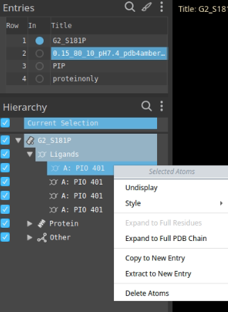

### Step 2 — Align full PIP to the extracted headgroup

Select one headgroup entry, then select the full PIP entry. (The reference MUST be above.)

Open:

**Tools → Ligand Alignment**

Use:

- User-specified reference
- Constrain common substructure (MCS) → This ensures the headgroup atoms overlap perfectly.

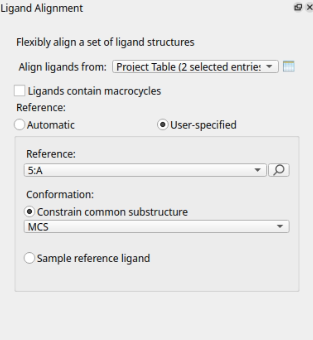

Repeat this for all four PIP molecules.

**Result:** You now have 4 full PIP2 molecules oriented exactly where the truncated headgroups originally were.

This preserves the biological headgroup placement inside the protein pocket.

## 4D. Extract the Ions

From `G2_S181P.pdb`, select the ions (K⁺):

Right-click → **Copy to New Entry**.

Place this new ions entry after the four aligned PIPs.

This ensures they are merged in the correct order later.

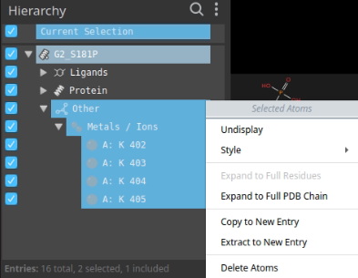

## 4E. Merge the Aligned Protein, PIPs, and Ions

Select:

- the aligned H++ protein,
- all 4 aligned PIP entries,
- the extracted ion entry.

Right-click → **Merge**.

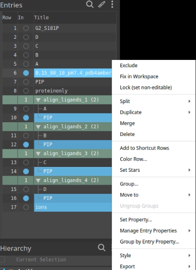

This gives one combined entry:

- Protein (correct protonation)
- Full PIP2 molecules
- K+ ions

This structure now fully contains everything except the membrane.

## 4F. Align the Merged Structure to the CHARMM-GUI Oriented Protein

We must now place the merged complex into the correct membrane orientation, provided by CHARMM-GUI.

To do this:

- Put `proteinonly.pdb` (CHARMM-GUI) above the merged entry
- Open **Protein Structure Alignment**
- Use **Residues** for alignment
  
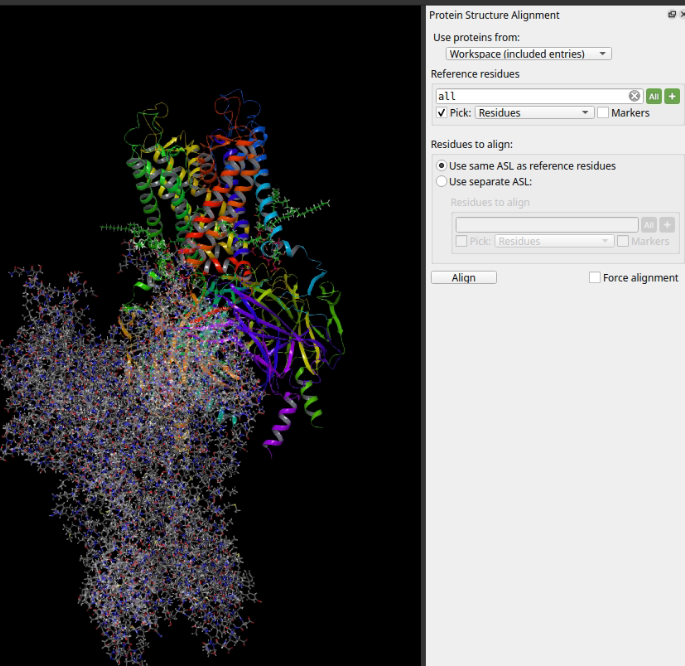

## 4G. Fix PIP Residue Numbers

Tleap requires PIPs to have unique residue numbers. So we have to change the PIP residue names in the merged and aligned structure.

We open the pdb file produce from H++ and we see that the last protein residue is 1312, so set:

- PIP A → 1313
- PIP B → 1314
- PIP C → 1315
- PIP D → 1316

Use:

**Build → Other Edits → Change Atom Properties → Residue Number**

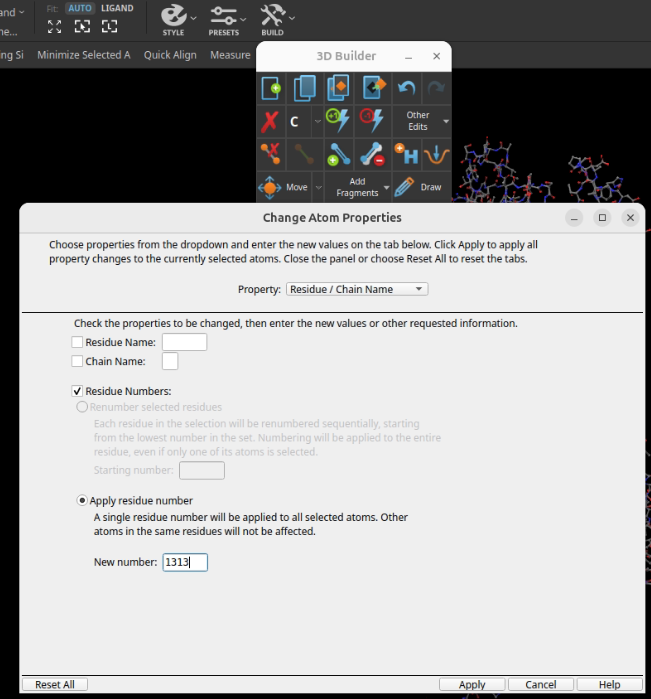

We do that for all 4 PIPs.

## 4K. Export the Final Merged Complex

The protein-pip-ion structure is now ready to be placed in the lipid bilayer, so we need to exposrt it.

Click on the merged structure and go to:

**File → Export Structures**

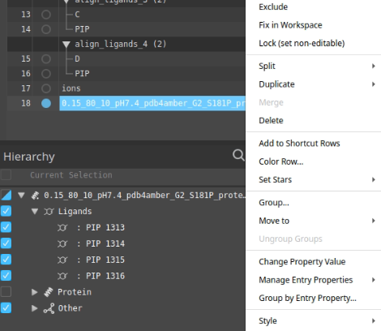

Save as:
```
G2_S181P_charm_aligned.pdb
```

This is now the complete protein + PIP2 + ions structure in the correct membrane orientation.

In the following steps, we make the necessary changes to G2_S181P_charm_aligned.pdb so that it is compatible with tleap.

## 4H. Convert CYS → CYX for Disulfide Bonds

Amber needs CYX to mark cysteines that form disulfide bonds.

Open your reference file (`pdb4amber_G2_S181P_proteinonly.pdb`) and identify all CYX residues:

- 80
- 112
- 408
- 440
- 736
- 768
- 1064
- 1096

Change these manually in the merged PDB:
```
CYS → CYX
```
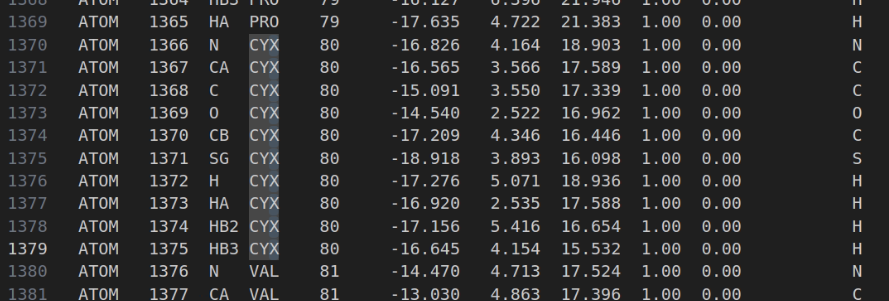

## 4I. Add TER at Chain Ends and after each PIP

TER cards must mark the end of each chain to avoid merging chains accidentally.

Search for **OXT**, which marks the end of a chain:

Insert a **TER** line after each OXT or chain end.

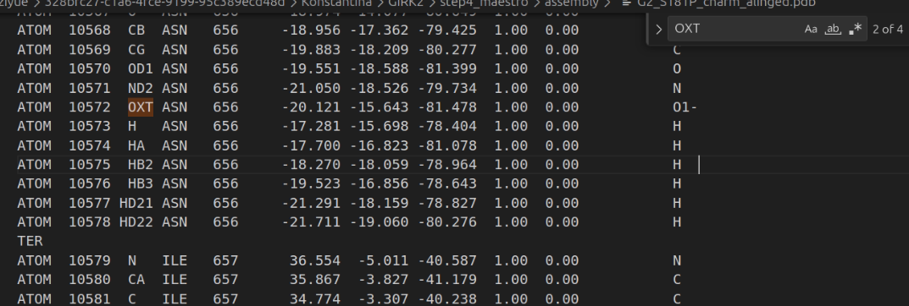

Then go at the end of each PIP and add **TER** as well.

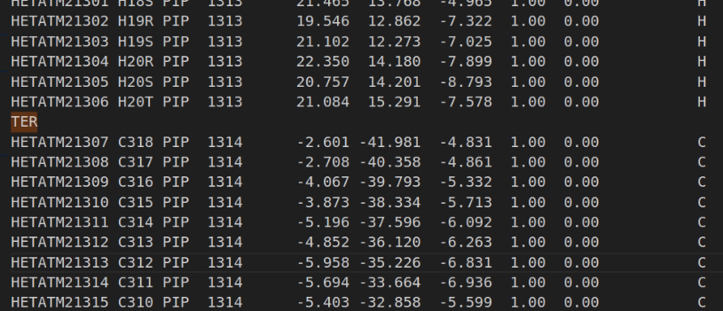


## 4J. Remove CONNECT and ANISOU Lines

Amber will crash if CONECT or ANISOU lines are present.

Scroll to the bottom and delete:

- every `CONECT` line
- every `ANISOU` line

This should clean up the PDB for tleap compatibility.

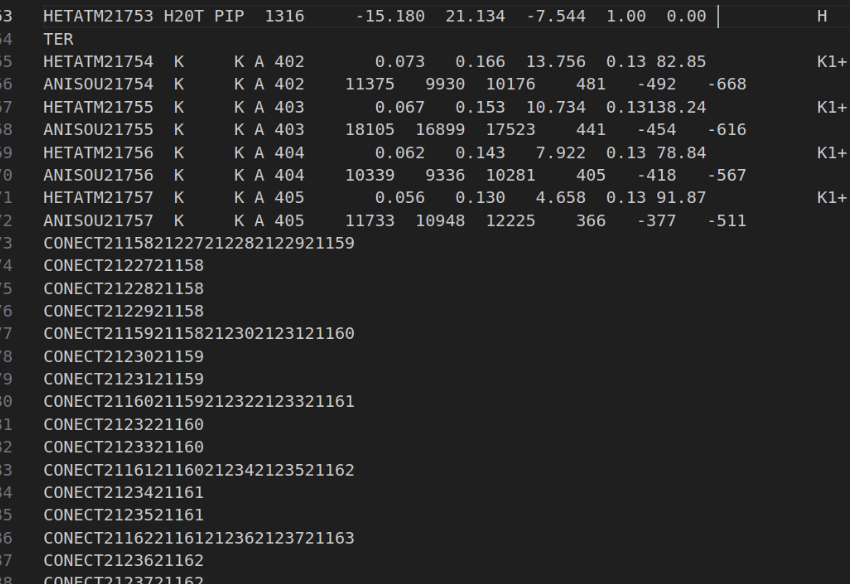

---

# 5. Combine the Assembled Protein With the CHARMM-GUI Lipid Bilayer

## 5A. Concatenate Protein/PIP/Ions With Lipids

Now we merge the protein with the memebrane that we extarcted earlier:
```bash
cat G2_S181P_charm_alinged.pdb membrane.pdb > combined_full_protein_with_lipid.pdb 
```

## 5B. Remove Hydrogens Before Running tleap

Hydrogens should be regenerated by tleap for correct Amber atom typing.

Use:
```bash
reduce -Trim combined_full_protein_with_lipid.pdb > combined_full_protein_with_lipid_noH.pdb
```
This is the final structure you will give to tleap.

---

# Summary

At the end of the system-assembly step in Maestro, you should now have a merged `combined_full_protein_with_lipid_noH.pdb` containing:
  - the assembled protein
  - four full PIP₂ molecules
  - potassium ions
  - the DOPC lipid bilayer
  - no hydrogens (tleap will add them)

Now you are ready for: [**Step 5 — Preparing the AMBER System (tleap)**](./tleap.md)
