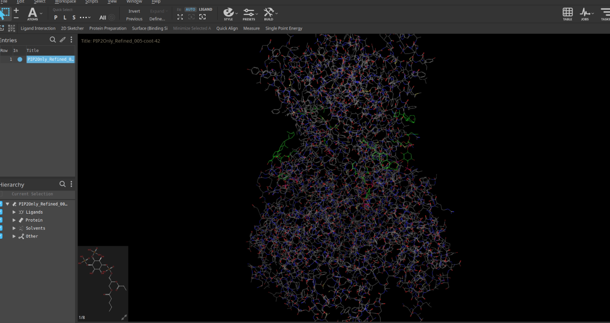
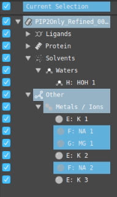
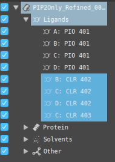
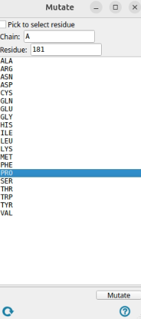
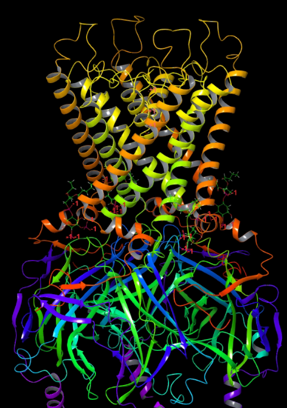
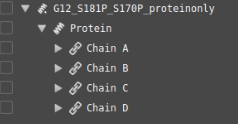

# System Preparation (Initial Structure Setup)

This section describes the full procedure for preparing the initial structure before protonation, membrane embedding, and AMBER parameterization. The goal is to start from the Cryo-EM structure, clean it, fix missing regions, and replace incomplete PIP₂ headgroups with full-length molecules.

---

## 1A. Obtain the Structure

Begin by downloading the appropriate Cryo-EM structure (PDB file) of your protein.  
Load the downloaded PDB into Maestro or your preferred molecular editing tool.

*Cryo-EM structure in Maestro*

---

## 1B. Clean the Structure

Once the structure is loaded, perform the following checks and edits.

1) Decide if we want to keep the water or not. 

2) Decide what ions we need to keep. 

3) Decide if we need ligand. 

4) Check for mutations. 

5) Spot the missing loops. 

---

### **1. Decide Whether to Keep the Waters**

Cryo-EM models often include water molecules.  
Water does not interfere with the cleanup process, so it can be kept.

You can view or remove waters in Maestro under:

**Solvents → Waters → HOH**

 
*Waters in Hierarchy menu in Maestro*

Water will be re-added later in AMBER anyway.

---

### **2. Decide Which Ions to Keep**

Cryo-EM structures frequently contain ions (K⁺, Na⁺, Mg²⁺).  
For potassium channels, keep **only K⁺ ions** near the pore.

In Maestro:

- Open **Metals / Ions**
- Keep K⁺ ions (e.g., K1, K2, K3)
- Delete Na⁺, Mg²⁺, and all others unless required

 
*Ions in Hierarchy menu in Maestro*

---

### **3. Decide Whether to Keep Ligands**

Ligands include small molecules, PIP headgroups, cholesterol, detergents, or co-crystallized inhibitors.  
H++ can only process proteins, so **all ligands must be removed** now.

Scenarios:

1. No ligand → nothing to do  
2. Ligand will be used → delete now, add later  
3. Different ligand will be used → delete existing, add new one later

PIP₂ and cholesterol are listed under **Ligands**.  
For GIRK channels:

- Delete cholesterol  
- Keep PIP headgroups temporarily

 
*Ligands in Hierarchy menu in Maestro*

---

### **4. Check for Mutations**

PDB structures often include mutations.  
If you do not want these:

1. Open **Mutate Residues**  
2. Select chain + residue  
3. Choose the correct wild-type residue  
4. Apply

Example: revert **S181.A → Pro**.

 
*Mutation menu in Maestro, we mutate S181 in chain A to proline*

---

### **5. Spot and Fix Missing Loops**

Cryo-EM structures commonly lack flexible loops.

To rebuild loops:

1. Open **Protein Preparation Wizard**  
2. Select **Preprocess** only  
3. Click **More Options**  
4. Enable **Fill in missing loops**  
5. Provide the **FASTA sequence**

Maestro will rebuild all missing segments.

 
*Protein after adding missing loops, ribbons appear connected*

---

### ** Save the Final Cleaned Structures**

You need two PDB files:

#### **1. Protein-only PDB**
Required for H++, because it cannot process lipids or ligands.

 
*Protein after we deletd all lipids and ions*

#### **2. Full system PDB (protein + full PIP₂ + future ligands)**
Required later for membrane setup and tleap.

Export using:

**File → Export Structures → PDB**

Examples:

- `G12_S181P_S170P.pdb`
- `G12_S181P_S170P_proteinonly.pdb`

---

## Summary

At the end of this step, you should have:

- Clean Cryo-EM structure  
- Correct ions kept  
- Mutations fixed  
- Missing loops rebuilt 
- Protein-only PDB for H++

Next step: **Protonation and pKa Assignment (H++ Server)**.
