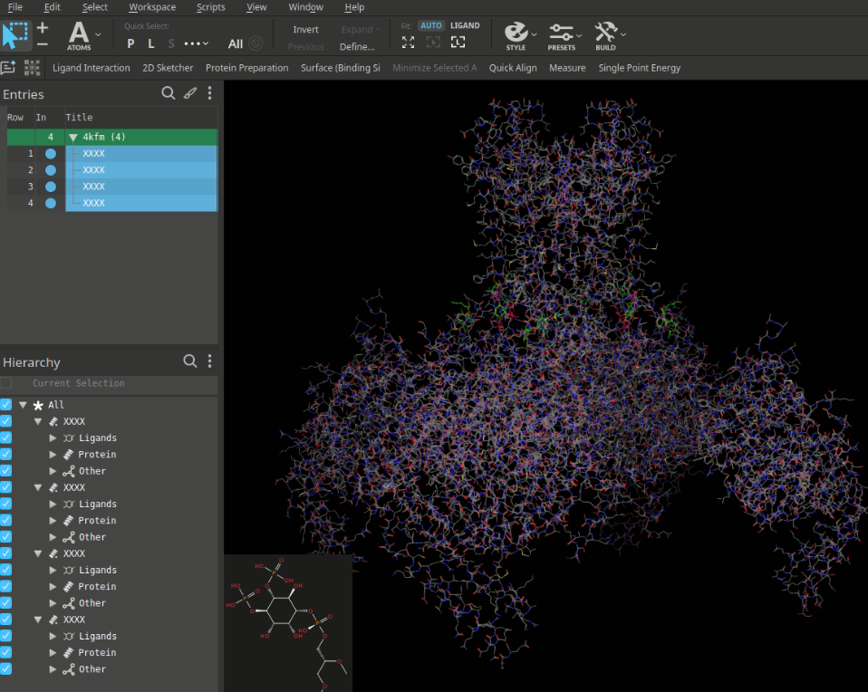
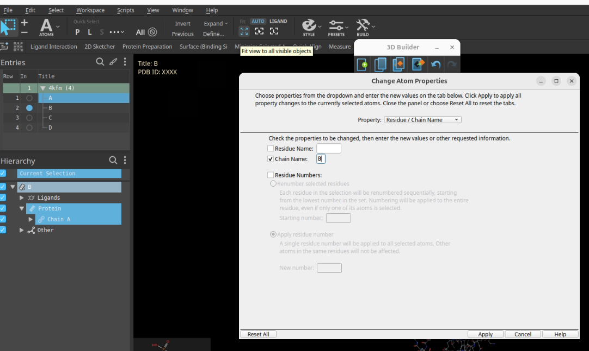
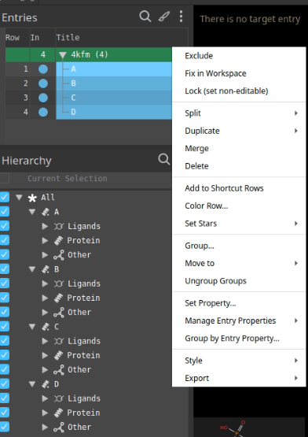
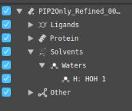
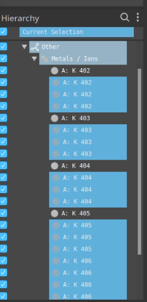
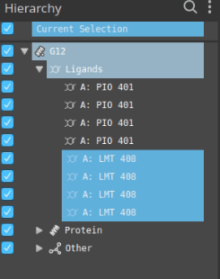
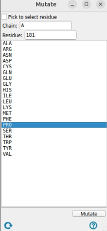
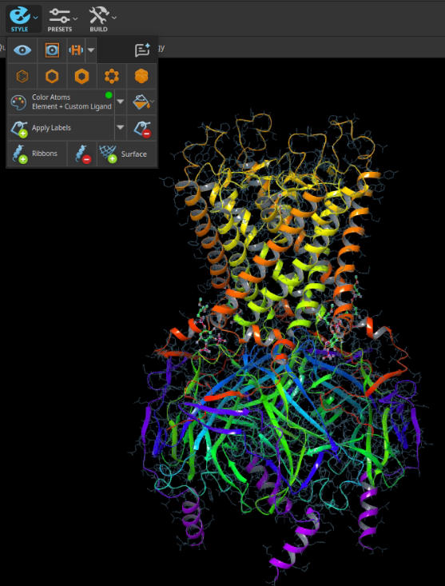
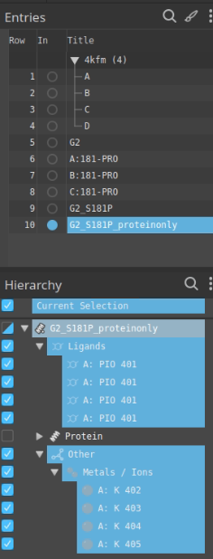
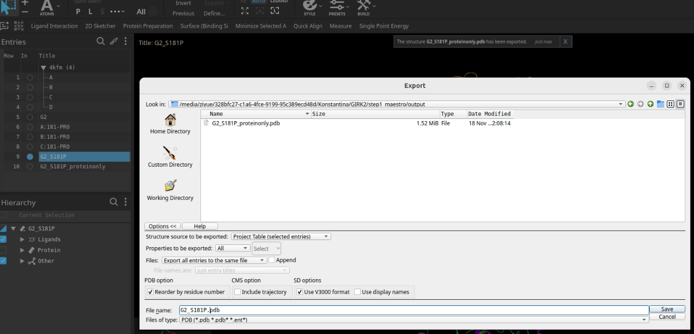

# System Preparation (Initial Structure Setup)

This section describes the full procedure for preparing the initial structure before protonation, membrane embedding, and AMBER parameterization. The goal is to start from the Cryo-EM structure, clean it, fix missing regions, and replace incomplete PIP₂ headgroups with full-length molecules.

---

## 1A. Obtain the Structure

Begin by downloading the Cryo-EM structure (PDB file) of GRIK2 channel at https://www.rcsb.org/structure/4KFM. You will download the file by clicking Download Files → Biological assembly (PDB - gz). You will end up with a .gz file that contains the 4kfm.pdb1.

Load the downloaded PDB into Maestro.

  
*Cryo-EM structure in Maestro*

You can see that there are 4 chains called XXXX. We can rename them to A, B, C, and D. It is important to rename them correctly so that we can keep track of the chains later.

Before the rename, we should remove the Gβγ that also exists in our system. Under protein you can see chains A, B, and G. We want to remove B and G, and we will rename the A chains in 3 subunits to B, C, and D. To do that, we select the subunit, go to 3D builder, then to other edits, and then we click the chain name and write the new name, then we click apply.

We want to merge the 4 chains into one entry, so we select all 4 chains, right-click, and click merge. We can call the new entry G2.

---

## 1B. Clean the Structure

Once the structure is loaded, perform the following checks and edits:

1) Decide if we want to keep the water or not.

2) Decide what ions we need to keep.

3) Decide if we need ligands.

4) Check for mutations.

5) Spot the missing loops.

---

### **1. Decide Whether to Keep the Waters**

Cryo-EM models often include water molecules.  
Water does not interfere with the cleanup process, so it can be kept.

You can view or remove waters in Maestro under:

**Solvents → Waters → HOH**

 
*Waters in Hierarchy menu in Maestro*

Water will be re-added later in AMBER anyway.

This step is not included in the GIRK2 cryo-EM structure, but it is a general step that we should keep in mind.

---

### **2. Decide Which Ions to Keep**

Cryo-EM structures frequently contain ions (K⁺, Na⁺, Mg²⁺).  
For potassium channels, keep **only K⁺ ions** near the pore.

In Maestro:

- Open **Metals / Ions**
- Keep K⁺ ions (e.g., K1, K2, K3)
- Delete Na⁺, Mg²⁺, and all others unless required

 
*Ions in Hierarchy menu in Maestro*

In our system, we also have to delete the duplicates of the same K ions which were caused by the merging.

 

---

### **3. Decide Whether to Keep Ligands**

Ligands include small molecules, PIP headgroups, cholesterol, detergents, or co-crystallized inhibitors.  
H++ can only process proteins, so **all ligands must be removed** now.

Scenarios:

1. No ligand → nothing to do  
2. Ligand will be used → delete now, add later  
3. Different ligand will be used → delete existing, add new one later

PIP₂ and cholesterol are listed under **Ligands**.  
For GIRK channels:

- Delete cholesterol and/or LMT
- Keep PIP headgroups temporarily

 
*Ligands in Hierarchy menu in Maestro*

---

### **4. Check for Mutations**

PDB structures often include mutations.  
If you do not want these:

1. Open **Mutate Residues**  
2. Select chain + residue  
3. Choose the correct wild-type residue  
4. Apply

Example: revert **S181.A → Pro**.

 
*Mutation menu in Maestro, we mutate S181 in chain A to proline*

---

### **5. Spot and Fix Missing Loops**

Cryo-EM structures commonly lack flexible loops.

To rebuild loops:

1. Open **Protein Preparation Wizard**  
2. Select **Preprocess** only  
3. Click **More Options**  
4. Enable **Fill in missing loops**  
5. Provide the **FASTA sequence**

Maestro will rebuild all missing segments.

This step does not apply to our example because we do not have missing loops, but you will see it in G12.

 
*No missing loops for 4KFM cryo-EM structure*

---

### **Save the Final Cleaned Structures**

You need two PDB files:

#### **1. Protein-only PDB**
Required for H++, because it cannot process lipids or ligands.

 
*We havet to delete all lipids and ions*

#### **2. Full system PDB (protein + full PIP₂ + future ligands)**
Required later for membrane setup and tleap.

Export using:

**File → Export Structures → PDB**

 

Examples:

- `G2_S181P.pdb`
- `G2_S181P_proteinonly.pdb`

---

## Summary

At the end of this step, you should have:

- Clean Cryo-EM structure  
- Correct ions kept  
- Mutations fixed  
- Missing loops rebuilt 
- Protein-only PDB for H++

You are now ready for: [**Protonation and pKa Assignment (H++ Server)**](./h++.md)
