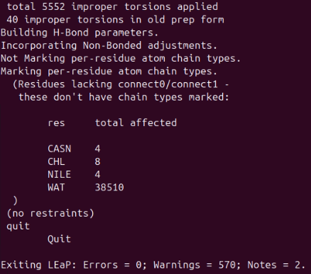

# 5. Preparing the AMBER System (tleap)

This section describes how to generate the AMBER topology (`prmtop`) and coordinate (`inpcrd`) files using tleap. We begin by determining the box dimensions, then run tleap with the correct force-field parameters, disulfide bonds, and lipid/PIP parameters.

## 5A. Determine the Box Dimensions

We first calculate the dimensions of our system using the merged structure without hydrogens:

```bash
./vmd_box_dims.sh -i combined_full_protein_with_lipid_noH.pdb -s water
```

Example output:

```
108.46999740600586, 108.581001281738284, 160.60500335693359
```

These values define the size of the simulation box and will be inserted into the `tleap.in` file:

```
set mol box {108.46999740600586, 108.581001281738284, 160.60500335693359
```

## 5B. tleap Input File

Below is the `tleap.in` file used to build the system. This file loads all required force fields, PIP parameters, ion parameters, adds hydrogens, defines disulfide bonds, sets the box, and writes out the AMBER topology.

```
source leaprc.protein.ff19SB
source leaprc.gaff2
source leaprc.lipid21
source leaprc.water.tip3p
loadamberparams frcmod.ionsjc_tip3p
loadamberprep PIP.prepi
loadamberparams PIP.frcmod

abc = loadpdb combined_full_protein_with_lipid_noH.pdb
savepdb abc first_with_hydrogens.pdb
mol = loadpdb first_with_hydrogens.pdb
bond mol.80.SG mol.112.SG
bond mol.408.SG mol.440.SG
bond mol.736.SG mol.768.SG
bond mol.1064.SG mol.1096.SG

addions mol K+ 0
addions mol Cl- 0
set mol box {108.46999740600586, 108.581001281738284, 160.60500335693359}
saveamberparm mol com.prmtop com.inpcrd
quit
```

## 5C. Add Disulfide Bonds

Our protein contains several disulfide bridges. During the Maestro preparation step, we renamed the cysteines that form these bonds from CYS → CYX. Amber requires us to define each disulfide explicitly, so we add the following lines in `tleap.in`:

```
bond mol.80.SG   mol.112.SG
bond mol.408.SG  mol.440.SG
bond mol.736.SG  mol.768.SG
bond mol.1064.SG mol.1096.SG
```

This ensures that tleap builds the correct S–S linkages in the final topology.

A detailed explanation of all remaining tleap.in commands are provided in this section. [**tleap.in**](./tleap_file.md)

## 5D. Run tleap

Run tleap using:

```bash
tleap -s -f tleap.in > leap.out &
```

This command:

- runs tleap with your input file
- writes all output to `leap.out`
- runs in the background

## 5E. Verifying Correct TER Placement

When TER cards are correctly placed in the PDB, tleap prints lines like:

```
Mapped residue ILE → NILE
Mapped residue ARG → CARG
Mapped residue ALA → CALA
Mapped residue SER → CSER
```

This confirms that:

- each protein chain was recognized
- chain breaks were correctly interpreted
- the PDB formatting is valid for Amber

## 5F. Monitor tleap Progress

To monitor tleap in real time, use:

```bash
tail -f leap.out
```

This is helpful for spotting warnings or errors as they appear.

## 5G. Successful tleap Output

A correct tleap run ends with a block similar to:

```
total 5548 improper torsions applied
40 improper torsions in old prep form
Building H-Bond parameters.
Incorporating Non-Bonded adjustments.
Exiting LEaP: Errors = 0; Warnings = 570; Notes = 2.
```

Key indicators of success:

- Errors = 0
- Warnings are normal for lipid systems
- Disulfide bonds were processed
- PIP improper torsions were recognized

 <br>

## 5H. Generate a Clean AMBER PDB

To produce a readable PDB from the AMBER topology, use:

```bash
ambpdb -p com.prmtop -c com.inpcrd > com_from_amber.pdb
```

This file helps you identify:

- residue ranges for the protein and PIPs
- lipid ranges

We will use these ranges in minimization and heating scripts

---

# Summary

At the end of the tleap preparation step, you should have:

- A fully parameterized Amber system
- `com.prmtop` (topology)
- `com.inpcrd` (coordinates)
- A clean Amber-generated PDB (`com_from_amber.pdb`)

You are now ready for: [**Step 6 —  Energy Minimization, Heating, Equilibration, and Production MD**](./min_heat_hold_prod.md)
